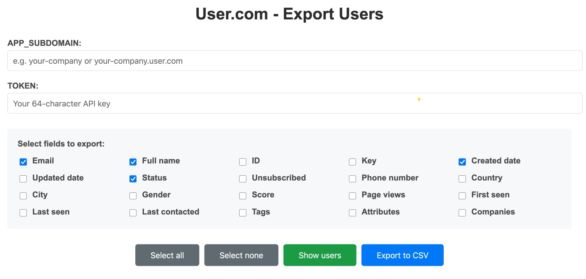

# User.com Export Tool

Tool for exporting users from User.com API to CSV file with web interface.



## Features

- ✅ Input fields for TOKEN and APP_SUBDOMAIN
- ✅ Selection of 20 different fields for export
- ✅ User preview in table with pagination (100 per page)
- ✅ CSV export with date: `user_list_YYYY_mm_dd.csv`
- ✅ API pagination handling (fetching all users)
- ✅ Responsive interface

## Installation

1. Install Node.js (version 14+)
2. Install dependencies:

```bash
npm install
```

## Running

1. Start the server:
```bash
npm start
```

2. Open browser and go to: http://localhost:3000

**IMPORTANT:** The application must be run through Node.js server (`npm start`), you cannot open the `index.html` file directly due to CORS issues.

## Usage

1. Open http://localhost:3000 in browser
2. Enter your User.com subdomain (e.g. `your-company` or `your-company.user.com`)
3. Enter your 64-character API TOKEN
4. Select fields to export/display
5. Click "Show users" to view the table
6. Click "Export to CSV" to download the file

## File structure

```
├── index.html      # Main interface
├── styles.css      # CSS styles
├── script.js       # JavaScript logic
├── server.js       # Node.js server (proxy for CORS)
├── package.json    # npm dependencies
└── README.md       # This documentation
```

## Troubleshooting

### CORS Issues
The application uses a local proxy server, so you must run `npm start` instead of opening `index.html` directly.

### API Issues
Check if:
- TOKEN is correct (64 characters)
- Subdomain is correct (without `https://` and `.user.com`)
- You have API permissions

## Technologies

- **Frontend**: HTML, CSS, JavaScript
- **Backend**: Node.js, Express
- **API**: User.com Public API v2
